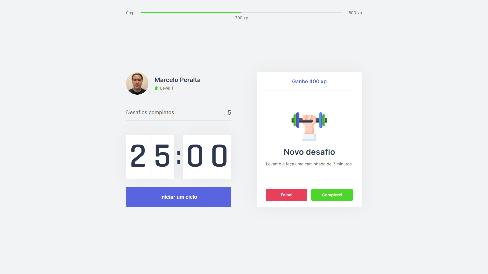

:link: https://marcelosperalta-moveit.vercel.app/

# [Next Level Week 04](https://nextlevelweek.com/)

_trilha:_  

**React**  

_app:_  

**Pomodoro Technique**  

_screenshot:_  



### Environment

- Visual Studio Code;
- Node + NPM;
- Yarn;
- TypeScript;
- React;
- Next.js.

## Aula 1 - 22.02.2021 - Rumo ao próximo nível 

**folder**

moveit

**install**  

```
yarn create react-app moveit --template=typescript
```

**start**  

```
cd moveit
```

```
yarn start
```

## Aula 2 - 23.02.2021 - Desvendando o Next.js

- [SPA - Single-page application](https://en.wikipedia.org/wiki/Single-page_application)  
- [SSR - Server-side rendering](https://en.wikipedia.org/wiki/Server-side_scripting)  
- [SSG - Static site generators](https://www.netguru.com/blog/what-are-static-site-generators)  

The three most popular ways to start a React project are:  

- SPA > [create-react-app](https://reactjs.org/docs/create-a-new-react-app.html#create-react-app);  
- SSG > [Gatsby](https://www.gatsbyjs.com/);  
- SPA+SSR+SSG > [Next.js](https://nextjs.org/);  

Migrate the project to Next.js:  

**folder**

moveit-next

**install**  

```
yarn create next-app moveit-next
```

rename from ```_app.js``` and ```index.js``` to ```_app.tsx``` and ```index.tsx```  

```
yarn add typescript @types/react @types/react-dom @types/node -D
```

**start**  

```
yarn dev
```

```
http://localhost:3000/
```

### CSS

[CSS Modules](https://github.com/css-modules/css-modules)  

## Aula 3 - 24.02.2021 - Contexto e componentes

[useEffect](https://reactjs.org/docs/hooks-reference.html#useeffect)  
[createContext](https://reactjs.org/docs/context.html)  

## Aula 4 - 25.02.2021 - Melhorando a usabilidade da aplicação

[createContext](https://reactjs.org/docs/context.html)  

## Aula 5 - 26.02.2021 - Próximo nível com React

[localStorage](https://developer.mozilla.org/en-US/docs/Web/API/Window/localStorage)  
[sessionStorage](https://developer.mozilla.org/en-US/docs/Web/API/Window/sessionStorage)  
[IndexedDB](https://developer.mozilla.org/en-US/docs/Web/API/IndexedDB_API)  
[Web SQL Database](https://www.w3.org/TR/webdatabase/)  
[Cookies](https://developer.mozilla.org/en-US/docs/Mozilla/Add-ons/WebExtensions/API/cookies)  

### Cookies

[js-cookie](https://github.com/js-cookie/js-cookie)  

```
yarn add js-cookie
```

```
yarn add @types/js-cookie -D
```

### Deploy

[netlify](https://www.netlify.com/)  
[Vercel](https://vercel.com/)  

#### Vercel

[Vercel CLI](https://vercel.com/download)  

```
npm i -g vercel
```

```
vercel -h
```

```
vercel login
```

_on GitHub, give access to Vercel on your repository:_  

Settings > Applications > Installed GitHub Apps > Vercel > Configure > Repository access

_from you project folder path:_  

```
cd moveit-next
```

```
vercel
```