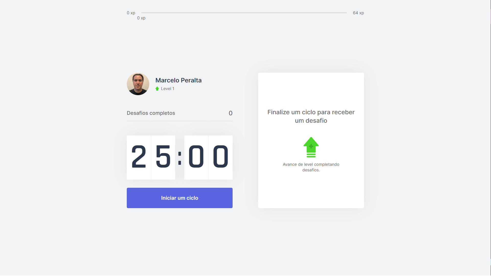
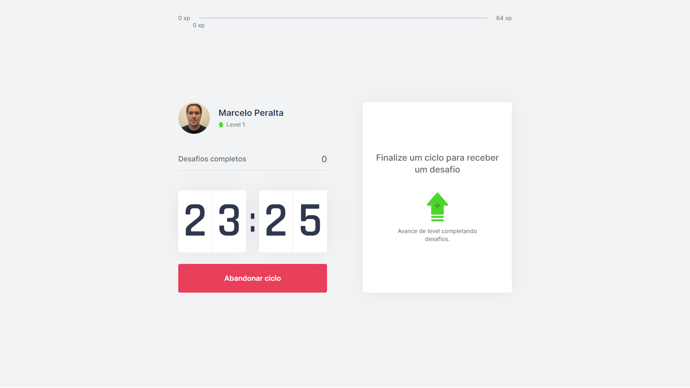
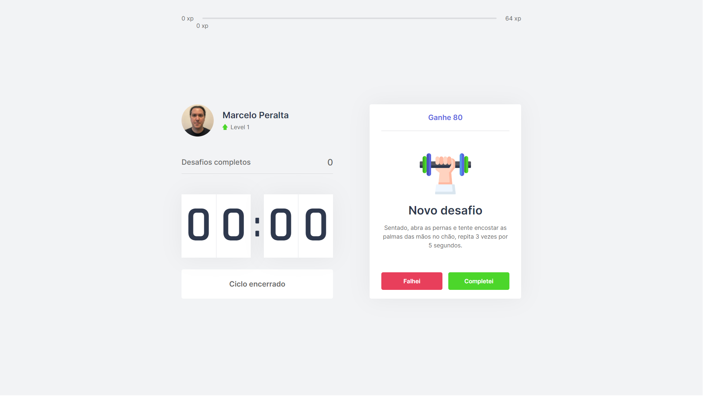

:link: https://marceloperalta-moveit.vercel.app/

# Pomodoro Technique App

A Pomodoro Technique App built with **[HTML](https://whatwg.org/)**, **[CSS](https://www.w3.org/Style/CSS/)**, **[JavaScript](https://developer.mozilla.org/en-US/docs/Web/JavaScript)**, **[TypeScript](https://www.typescriptlang.org/)**, **[React](https://reactjs.org/)**, and **[Node.js](https://nodejs.org/)**.  

<br>

<div align="center">
    
    
    &nbsp;
    
    &nbsp;
    &nbsp;
    
    &nbsp;
    
    &nbsp;
    
</div>

<br>

## :mortar_board: **_bootcamp:_**  

### [Rocketseat](https://rocketseat.com.br/)

#### [Next Level Week #4](https://nextlevelweek.com/)

*React* with [Diego Fernandes](https://github.com/diego3g)  


<br>

## :camera: **_screenshots:_**  

  

  

  
<br>

## :wrench: **_tools**  

[Microsoft Edge](https://www.microsoft.com/en-us/edge)  

[Google Chrome](https://www.google.com/chrome/)  

[Visual Studio Code](https://code.visualstudio.com/)  

[Visual Studio Code Extension "Launchbase Theme"](https://marketplace.visualstudio.com/items?itemName=maykbrito.theme-launchbase)  

[Figma](https://www.figma.com/)  

[js-cookie](https://github.com/js-cookie/js-cookie)
<br>

## :dvd: **install**

on bash / terminal  
```
yarn create next-app moveit-next
```

```
yarn add typescript @types/react @types/react-dom @types/node -D
```

```
yarn add js-cookie
```

```
yarn add @types/js-cookie -D
```
<br>

## :runner: **_run the project:_**  

on bash / terminal  
```
cd moveit-next
```

```
yarn start
```

```
http://localhost:3000/
```
<br>

## :rocket: **_deploy to [Vercel](https://vercel.com/):_**

[Vercel CLI](https://vercel.com/download)  

on bash / terminal  
```
npm i -g vercel
```

```
vercel -h
```

```
vercel login
```

_from you project folder path:_  

```
cd moveit-next
```

```
vercel
```

_project update:_  

stage  
```
vercel
```

prod  
```
vercel --prod
```
<br>

## :green_book: **_concepts:_**  

[SPA - Single-page application](https://en.wikipedia.org/wiki/Single-page_application)  
[SSR - Server-side rendering](https://en.wikipedia.org/wiki/Server-side_scripting)  
[SSG - Static site generators](https://www.netguru.com/blog/what-are-static-site-generators)  

The three most popular ways to start a React project are:  

- SPA > [create-react-app](https://reactjs.org/docs/create-a-new-react-app.html#create-react-app);  
- SSG > [Gatsby](https://www.gatsbyjs.com/);  
- SPA+SSR+SSG > [Next.js](https://nextjs.org/);  

[CSS Modules](https://github.com/css-modules/css-modules)  

[useEffect](https://reactjs.org/docs/hooks-reference.html#useeffect)  
[createContext](https://reactjs.org/docs/context.html)  

[localStorage](https://developer.mozilla.org/en-US/docs/Web/API/Window/localStorage)  
[sessionStorage](https://developer.mozilla.org/en-US/docs/Web/API/Window/sessionStorage)  
[IndexedDB](https://developer.mozilla.org/en-US/docs/Web/API/IndexedDB_API)  
[Web SQL Database](https://www.w3.org/TR/webdatabase/)  
[Cookies](https://developer.mozilla.org/en-US/docs/Mozilla/Add-ons/WebExtensions/API/cookies)  

## :blue_book: **_references:_**  

[How to Write an Awesome GitHub README](https://healeycodes.com/github/beginners/tutorial/productivity/2019/04/14/writing-an-awesome-github-readme.html)  

[EMOJI CHEAT SHEET](https://www.webfx.com/tools/emoji-cheat-sheet/)  